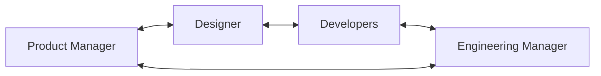
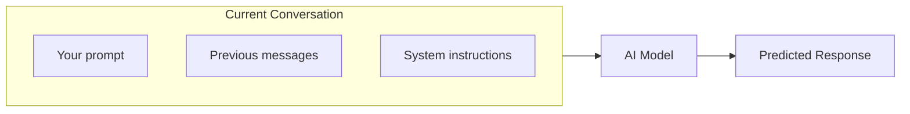
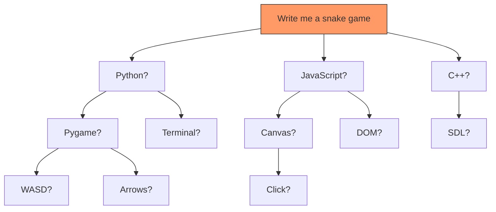
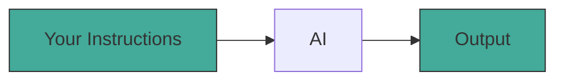
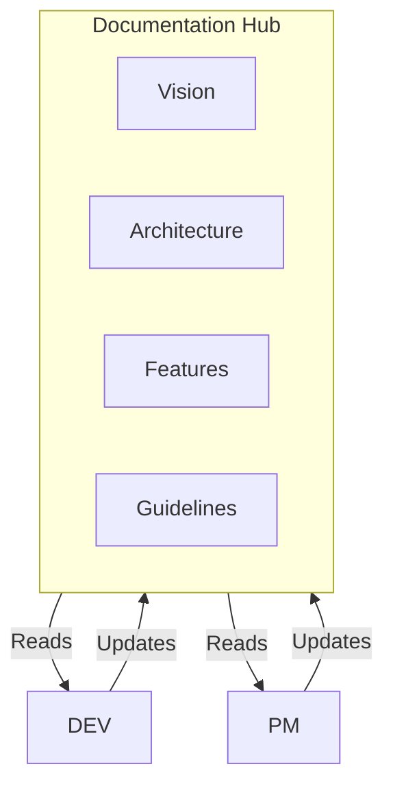
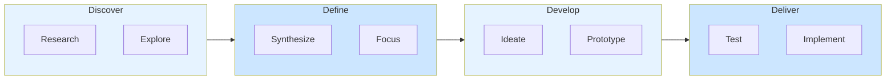
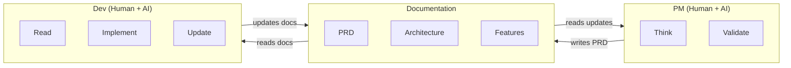
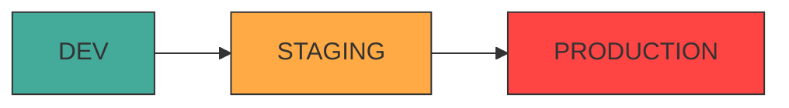

# Vibe Coding Done Right

## Applying Product Development Practices to AI-Assisted Development

 

Sprint Accelerator / FinTech House Lisbon

**Julien Deray** - Engineering Manager

---

# Icebreaker

<v-click>

## Who here has been relying primarily on AI to build their product?

</v-click>

<v-click>

 

### What's been your experience?

- The magic moments
- The pain points

</v-click>

<!--
Let them surface "it's fast!" and "it deleted my database" stories naturally.
This sets up the problem we're solving.
-->

---

# About Me

 

- Engineering Manager, former developer
- Mentor at Sprint Accelerator
- "I've seen how great teams ship great products—and how AI changes the game"

---

# What a Product Team Looks Like

 

 

<v-click>

**Key point:** Each role has specific responsibilities. AI can assist with many—but someone still needs to **think**.

</v-click>

---
layout: section
---

# Part 2: Understanding AI

---

# How AI Actually Works
### The 30-Second Version

 

 

<v-clicks>

- AI predicts "what word comes next" based on everything it's seen
- It has **NO memory**—only what's in the current conversation
- It can write endlessly, but quality depends on what you give it

</v-clicks>

---

# The Divergence Problem

 

<v-click>

**"It works, but it's not YOUR vision"**

</v-click>

---

# Quality In = Quality Out

 

 

| Vague | Precise |
|-------|---------|
| "Write a snake game" | "Write a snake game like Nokia 3310, arrow controls, wrap-around screen, pixel art style, score counter top-right" |
| Generic result | Exactly what you imagined |

<v-click>

**The AI is as precise as your instructions**

</v-click>

---

# AI Can't Imagine Something New

 

<v-clicks>

- AI was trained on what **already exists**
- You're building something **NEW**—that vision must come from **YOU**
- AI is a powerful executor, not a visionary

</v-clicks>

 

<v-click>

> "Spending 3 hours thinking before prompting beats spending 3 seconds"

</v-click>

---
layout: section
---

# Part 3: The Documentation-Centric Model

---

# The Problem with Conversations

 

<v-clicks>

- You can't have one infinite conversation with AI
- Context limits → AI starts **forgetting**
- Every new conversation = starting from zero

</v-clicks>

 

<v-click>

### "What if we could give AI perfect memory?"

</v-click>

---

# Documentation as the AI's Brain

 

 

<v-click>

**"Your docs ARE your product's brain"**

</v-click>

---

# Minimum Viable Documentation

 

What you need at MVP stage:

<v-clicks>

1. **Vision document** - What are we building? For whom? Why?
2. **User personas** - Who exactly uses this?
3. **Feature catalogue** - What exists, what's planned
4. **Architecture overview** - How the pieces fit together
5. **Development guidelines** - Conventions, patterns, constraints

</v-clicks>

 

<v-click>

**"Start simple. Update constantly."**

</v-click>

---

# The Double Diamond

 

 

**Product development is about diverging (exploring) then converging (deciding)**

---

# The PM-Doc-Dev Loop

 

 

<v-click>

**Humans are ALWAYS in the loop—reading, validating, testing, deciding**

</v-click>

---

# The PRD is Everything

 

**"The PRD is your contract with the AI developer"**

<v-clicks>

1. Problem statement (why?)
2. Context (what exists?)
3. Proposed solution (high-level)
4. User workflow (step by step)
5. Acceptance criteria (how do we know it's done?)
6. Technical context (constraints)
7. Goals and non-goals (scope)
8. Open questions (unclear items)

</v-clicks>

 

<v-click>

*"I'll show you a real example in the demo"*

</v-click>

---

# The Feedback Loop

 

After AI implements:

<v-clicks>

1. Human **tests** the result
2. Human **validates** against PRD
3. Dev (or AI) **updates documentation** with decisions made
4. PM **reads** updated docs before next PRD

</v-clicks>

 

<v-click>

**"This loop is what keeps quality high"**

</v-click>

---
layout: section
---

# Part 4: Practical Considerations

---

# Environments Matter

 

 

<v-clicks>

- "AI has a tendency to delete databases"
- **Never let AI touch production directly**
- Always have a place to experiment safely

</v-clicks>

---

# Testing (Work in Progress)

 

Honest take: **"I'm still refining this myself"**

 

<v-clicks>

But even imperfect testing is better than none:

- Make AI write tests for every feature
- Run tests before every deployment
- When you find a bug manually, make AI write a test for it

</v-clicks>

 

<v-click>

**"The goal: catch regressions before your users do"**

</v-click>

---
layout: section
---

# Part 5: Live Demo

---

# Demo Introduction

 

"Let me show you this in action"

<v-clicks>

- Wealth management app context
- Documentation structure walkthrough
- Watch how much context the AI receives

</v-clicks>

 

<v-click>

### Demo Flow:
1. Show existing documentation
2. PRD for a small feature
3. Feed PRD + docs to AI
4. AI generates implementation plan
5. AI implements (questions welcome!)
6. Review output together
7. Update docs with what was built

</v-click>

---

# What You Just Saw

 

<v-clicks>

- The **amount of context** that went in
- The **precision** of the output
- The **human checkpoints** throughout

</v-clicks>

 

<v-click>

**"This is vibe coding with discipline"**

</v-click>

---
layout: section
---

# Part 6: Key Takeaways

---

# Key Takeaways

 

<v-clicks>

1. **Quality input = Quality output**
   - The fundamental truth

2. **AI replaces typing, not thinking**
   - You still need product discipline

3. **Documentation is your AI's brain**
   - Keep it fresh, keep it precise

4. **Humans stay in the loop**
   - Test, validate, decide

</v-clicks>

---

# Your Monday Action

 

## "Document your work"

 

<v-click>

Start with:

- Vision
- Persona
- Current State
- Next Feature

</v-click>

 

<v-click>

**"If you can explain it clearly in writing, AI can help you build it"**

</v-click>

---

# Office Hours

 

## I'm available for 1:1 guidance on your specific setup

 

<v-click>

**Let's make this work for YOUR product**

</v-click>

---
layout: center
class: text-center
---

# Q&A

 

## What questions do you have?
